# 🚀 Web Messenger — FastAPI + React

<p align="center">
Модульный монолит · WebSocket · PostgreSQL · Redis · MinIO · Celery · Docker
</p>

---

## 📌 О проекте

**Web Messenger** — веб-мессенджер в браузере (без скачивания), спроектированный для масштабирования до **5000 активных пользователей**.

🎯 Технологии:
- 🔵 **Backend:** FastAPI · WebSocket · PostgreSQL · Redis · Celery · MinIO
- 🟣 **Frontend:** React · Vite · TypeScript · Zustand · Tailwind
- 🟢 **DevOps:** Docker · Docker Compose · Makefile

Принципы: **модульный монолит**, **строгий API контракт**, **разделение фронта и бэка**, **чистая архитектура**, **готовность к росту**.

---

## 📐 Архитектура

### Общая схема (mermaid)

```mermaid
flowchart TB
    subgraph Browser["Browser (SPA)"]
        FE["React + Vite + OpenAPI TS client"]
    end

    FE -- "HTTPS (REST)" --> API["/api (FastAPI)"]
    FE -- "WSS (real-time)" --> WS["/ws (WebSocket)"]

    subgraph Backend["FastAPI backend (модульный монолит)"]
        API --> SVC["services"]
        WS --> SVC
        SVC --> REPO["repositories"]
    end

    REPO --> PG[(PostgreSQL)]
    SVC --> REDIS[(Redis<br/>cache + pub/sub)]
    SVC --> CELERY["Celery worker<br/>(email/offline)"]
    SVC --> MINIO[(MinIO<br/>files via presigned URL)]
```


📄 Подробности: [ARCHITECTURE.md](docs/ARCHITECTURE.md) · [BACKEND_STRUCTURE.md](docs/BACKEN_STRUCTURE.md) · [FRONTEND_STRUCTURE.md](docs/FRONTEND_STRUCTURE.md)

---

## 🔗 REST & WebSocket контракт
Источник истины: **[API_CONTRACT.md](docs/API_CONTRACT.md)**. По нему генерируется TS-клиент.

---

## 🤖 Роли AI-разработчиков
- 🟢 Агент A — Backend (FastAPI, DB, Redis, Celery, MinIO, Docker)
- 🔵 Агент B — Frontend (React, WS клиент, OpenAPI TS клиент, Zustand)

Правила: [AI_ROLES.md](docs/AI_ROLES.md) · [DEV_WORKFLOW.md](docs/DEV_WORKFLOW.md)

---

## 🗂️ Структура
```
project/
├── backend/              # FastAPI backend (модульный монолит)
│   ├── app/
│   ├── alembic/
│   ├── Dockerfile
│   └── requirements.txt
├── frontend/             # React/Vite frontend
│   ├── src/
│   ├── Dockerfile
│   └── package.json
├── docker-compose.yml
├── Makefile
└── docs/
    ├── ARCHITECTURE.md
    ├── API_CONTRACT.md
    ├── AI_ROLES.md
    ├── BACKEN_STRUCTURE.md
    ├── FRONTEND_STRUCTURE.md
    ├── SPRINT_PLAN.md
    └── DEV_WORKFLOW.md
```

---

## 🚀 Быстрый старт (локально)
```bash
cp .env.example .env
make up
```
Открой: Frontend http://localhost:3000 · Swagger http://localhost:8000/docs · MinIO http://localhost:9000 · MailHog http://localhost:8025  
Остановить: `make down`

---

## 🧪 Полезные команды
```bash
make backend    # перезапуск backend
make frontend   # перезапуск frontend
make celery     # перезапуск celery
make logs       # логи всех сервисов
make migrate    # миграции (после появления моделей)
```

---

## 🧱 План спринтов
6 спринтов от инфры до стабилизации: [SPRINT_PLAN.md](docs/SPRINT_PLAN.md)

---

## 🧩 Фичи
- 🔥 WebSocket: сообщения, typing, online, ACK
- 🖼️ MinIO + presigned URLs: загрузка и хранение файлов
- ✉️ Email оффлайн-уведомления (Celery + MailHog локально)
- 📱 SPA с адаптивом

---

